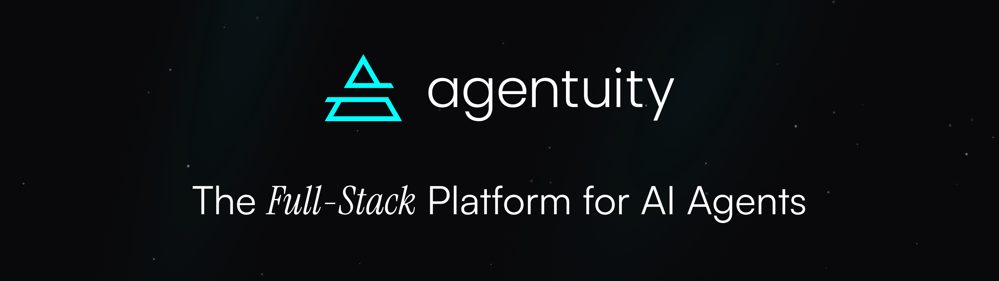

<div align="center">
     <br/>
<br />
<a href="https://npm.im/@agentuity/runtime"></a>
<a href="https://github.com/agentuity/sdk/blob/main/README.md"></a>
<a href="https://discord.gg/vtn3hgUfuc"></a>
</div>
<br />

# Getting Started

The fastest way to install and get started is to install the CLI:

```bash
curl -fsSL https://agentuity.sh | sh
```

<div align="center">
  <a href="https://www.youtube.com/watch?v=hOhMqY2T7so">
    
  </a>
</div>

<p>&nbsp;</p>

Visit [https://agentuity.com/](https://agentuity.com/) to learn more about Agentuity and create a free account or sign up in the CLI after installation.

# Documentation

Visit [https://agentuity.dev](https://agentuity.dev/) to view the full documentation.

# Community

The Agentuity community can be found on [GitHub Discussions](https://github.com/agentuity/sdk/discussions) where you can discuss ideas, give feedback and share your projects with others.

To chat with other community members you can join the [Agentuity Discord server](https://discord.gg/agentuity).

# Development

## Structure

The structure of this mono repository:

- `packages/auth` - Agentuity unified Authentication package
- `packages/claude-code` - Claude Code plugin with multi-agent coding team
- `packages/cli` - the Agentuity command line tool
- `packages/core` - Shared utilities used by most packages
- `packages/drizzle` - Drizzle ORM integration with resilient PostgreSQL connections
- `packages/evals` - Reusable Evaluation Presets
- `packages/frontend` - Reusable code for web frontends including WebRTC peer connections
- `packages/opencode` - Opencoder agent plugins for Agentuity
- `packages/postgres` - Resilient PostgreSQL client with automatic reconnection
- `packages/react` - React package for the Browser including WebRTC hooks
- `packages/runtime` - Server-side package for the Agent runtime with WebRTC signaling
- `packages/schema` - Schema validation library similar to zod and arktype
- `packages/server` - Runtime-agnostic server-side SDK (Node.js & Bun)
- `packages/test-utils` - Internal test utilities that can be used by packages
- `packages/vscode` - VS Code extension for Agentuity
- `packages/workbench` - Workbench UI component

Each package is its own published npm package but all packages are versioned and published together.

## Setup

```bash
bun install
```

## Build

```bash
bun run build
```

## Testing

Run the following to do a cycle of `lint`, `typecheck`, `format` and `test`:

```bash
bun all
```

For development workflow verification, ensure all commands run successfully before creating a PR.

## Linking to External Projects

To use the SDK in development mode with an existing project outside this repo:

```bash
./scripts/link-local.sh /path/to/your/project
```

This script builds all packages, creates tarballs, and installs them in your target project. After linking, run `bun run build` or `bun run dev` in your project to rebuild with the local SDK changes.

# LICENSE

See the [LICENSE](./LICENSE.md) for more information about the license to this project. The code is licensed under the Apache-2 License.
