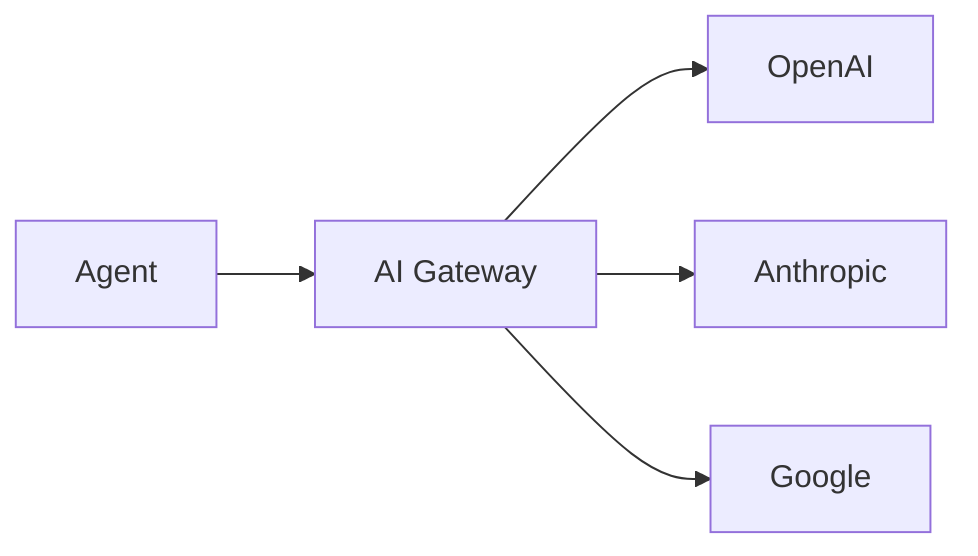

This page demonstrates all MDX features available in the docs framework.

## Mermaid Diagram

Mermaid diagrams are rendered at build time as SVGs:



## Code from File

Import code directly from source files using `remark-code-import`:

```typescript file=../../../agent/hello/agent.ts#L15-L32
```

## Theme Image

The `ThemeImage` component shows different images based on light/dark mode:

<ThemeImage baseName="test-img" alt="Test theme-aware image" width={800} height={400} />

Images are loaded from `/public/images/{baseName}-light.png` and `/public/images/{baseName}-dark.png`.

## CLI Command

The `CLICommand` component displays styled terminal commands:

<CLICommand command="agentuity dev">
Starting development server...
Server running at http://localhost:3500
</CLICommand>

<CLICommand command="agentuity new my-project" />

## Combined Example

Using multiple features together:

<Steps>
<Step>
Create a new project:
<CLICommand command="agentuity new my-project" />
</Step>
<Step>
Start development:
<CLICommand command="cd my-project && agentuity dev" />
</Step>
</Steps>

## Feature Summary

| Feature | Plugin/Component | Rendering |
|---------|-----------------|-----------|
| Mermaid | rehype-mermaid | Build-time SVG |
| Code Import | remark-code-import | Build-time |
| ThemeImage | React component | Client-side |
| CLICommand | React component | Server/Client |
