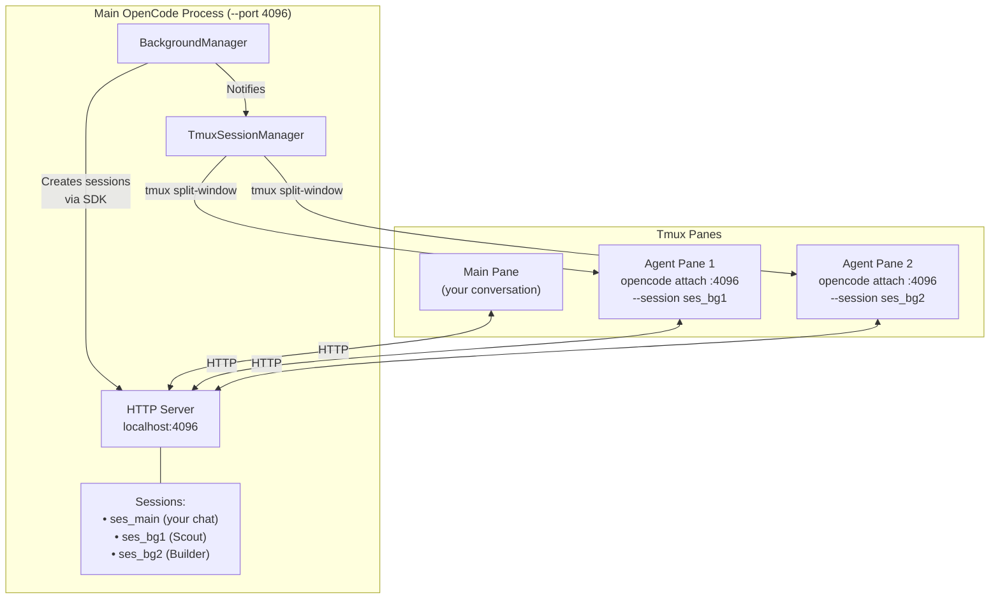
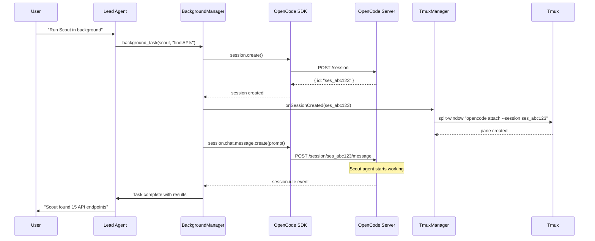

# @agentuity/opencode

An Open Code plugin providing a team of specialized AI agents with access to Agentuity cloud services and SDK expertise.

## Installation

```bash
agentuity ai opencode install
```

## Usage

In Open Code, use slash commands or `@mention` agents directly:

```
/agentuity-coder implement dark mode for settings page
/agentuity-cloud list all my KV namespaces
/agentuity-sandbox run bun test in a sandbox
```

## Commands

| Command                  | Description                                            |
| ------------------------ | ------------------------------------------------------ |
| `/agentuity-coder`       | Run tasks with the full agent team (Lead orchestrates) |
| `/agentuity-cadence`     | 🔄 Start a long-running autonomous loop                |
| `/agentuity-cloud`       | ☁️ Interact with any Agentuity cloud service           |
| `/agentuity-sandbox`     | 🏖️ Run code in isolated sandbox environments           |
| `/agentuity-memory-save` | Save session context to memory                         |

### Cloud Services via `/agentuity-cloud`

The Expert agent can operate any `agentuity cloud` subcommand:

| Service         | CLI                          | Examples                           |
| --------------- | ---------------------------- | ---------------------------------- |
| **KV**          | `agentuity cloud kv`         | `list namespaces`, `set key value` |
| **Storage**     | `agentuity cloud storage`    | `upload file`, `list buckets`      |
| **Vector**      | `agentuity cloud vector`     | `search for auth patterns`         |
| **Sandbox**     | `agentuity cloud sandbox`    | `run tests`, `create environment`  |
| **Database**    | `agentuity cloud db`         | `create table`, `run SQL`          |
| **SSH**         | `agentuity cloud ssh`        | `connect to deployment`            |
| **Deployments** | `agentuity cloud deployment` | `list`, `inspect`                  |
| **Agents**      | `agentuity cloud agent`      | `list`, `inspect`                  |
| **Sessions**    | `agentuity cloud session`    | `list`, `inspect`                  |
| **Threads**     | `agentuity cloud thread`     | `list`, `inspect`                  |

## Agent Team

| Agent         | Role                   | When to Use                                                         |
| ------------- | ---------------------- | ------------------------------------------------------------------- |
| **Lead**      | Orchestrator           | Automatically coordinates all work                                  |
| **Scout**     | Explorer               | Finding files, patterns, codebase analysis (read-only)              |
| **Builder**   | Implementer            | Interactive code changes, quick fixes, guided implementation        |
| **Architect** | Autonomous Implementer | Cadence mode, complex multi-file features, long-running tasks       |
| **Reviewer**  | Code Reviewer          | Reviewing changes, catching issues, suggesting fixes                |
| **Memory**    | Context Manager        | Storing/retrieving context, decisions, patterns across sessions     |
| **Expert**    | Agentuity Specialist   | CLI commands, cloud services, SDK questions                         |
| **Planner**   | Strategic Advisor      | Complex architecture decisions, deep technical planning (read-only) |
| **Runner**    | Command Executor       | Run lint/build/test/typecheck/format, returns structured summaries  |

### Builder vs Architect

| Aspect        | Builder                  | Architect                      |
| ------------- | ------------------------ | ------------------------------ |
| **Mode**      | Interactive              | Autonomous                     |
| **Best for**  | Quick fixes, guided work | Cadence mode, complex features |
| **Model**     | Claude Opus 4.5          | GPT 5.2 Codex                  |
| **Reasoning** | High                     | Maximum (xhigh)                |
| **Context**   | Session-based            | Checkpoint-based               |

**Use Builder when:** You're working interactively, making quick changes, or need guidance.

**Use Architect when:** Running Cadence mode, implementing complex multi-file features, or need autonomous execution with deep reasoning.

## Model Configuration

Each agent has a default model optimized for its role:

| Agent     | Default Model                          | Reasoning Level         |
| --------- | -------------------------------------- | ----------------------- |
| Lead      | `anthropic/claude-opus-4-5-20251101`   | max (extended thinking) |
| Scout     | `anthropic/claude-haiku-4-5-20251001`  | -                       |
| Builder   | `anthropic/claude-opus-4-5-20251101`   | high                    |
| Architect | `openai/gpt-5.2-codex`                 | xhigh                   |
| Reviewer  | `anthropic/claude-sonnet-4-5-20250929` | high                    |
| Memory    | `anthropic/claude-haiku-4-5-20251001`  | -                       |
| Expert    | `anthropic/claude-sonnet-4-5-20250929` | high                    |
| Planner   | `openai/gpt-5.2`                       | xhigh                   |
| Runner    | `anthropic/claude-haiku-4-5-20251001`  | -                       |

### Overriding Agent Models

You can override any agent's model via `opencode.json`:

```json
{
	"agent": {
		"Agentuity Coder Builder": {
			"model": "anthropic/claude-sonnet-4-5-20250514"
		},
		"Agentuity Coder Architect": {
			"model": "openai/gpt-5.2-codex",
			"reasoningEffort": "xhigh"
		}
	}
}
```

Run `opencode models` to see all available models.

### Configuration Options

**For OpenAI models:**

- `reasoningEffort`: `"low"` | `"medium"` | `"high"` | `"xhigh"` — controls reasoning depth

**For Anthropic models:**

- `variant`: `"low"` | `"medium"` | `"high"` | `"max"` — controls extended thinking level
- `thinking`: `{ "type": "enabled", "budgetTokens": 10000 }` — explicit thinking config

**General:**

- `model`: The model identifier (e.g., `"anthropic/claude-sonnet-4-5-20250514"`)
- `temperature`: Number between 0-1 (lower = more deterministic)
- `maxSteps`: Maximum tool use steps per turn

## Security

Sensitive CLI commands are blocked by default:

- `agentuity cloud secrets` / `secret`
- `agentuity cloud apikey`
- `agentuity auth token`

## Plugin Configuration

Plugin settings are configured in your Agentuity CLI profile (`~/.config/agentuity/production.yaml`). Add a `coder` section:

```yaml
name: production
preferences:
   orgId: org_xxx
coder:
   tmux:
      enabled: true
   background:
      defaultConcurrency: 3
```

All fields under `coder` are optional. See [Background Agents](#background-agents) and [Tmux Integration](#tmux-integration) for details.

**Note:** Agent model overrides go in `opencode.json` (see [Model Configuration](#model-configuration)), while plugin behavior settings go in the Agentuity profile.

## Recommended MCP Servers

Add to your `opencode.json` for enhanced Scout/Expert capabilities:

```jsonc
{
	"mcp": {
		"context7": { "type": "remote", "url": "https://mcp.context7.com/mcp" },
		"grep_app": { "type": "remote", "url": "https://mcp.grep.app" },
	},
}
```

| MCP          | Purpose             | Free Tier     |
| ------------ | ------------------- | ------------- |
| **context7** | Library docs lookup | 500 req/month |
| **grep_app** | GitHub code search  | Unlimited     |

## Cadence: Long-Running Autonomous Sessions

Cadence enables the agent team to work autonomously on complex tasks across multiple iterations until completion.

### Recommended Agent for Cadence

**Architect** is the recommended agent for Cadence mode. It uses GPT 5.2 Codex with maximum reasoning effort (`xhigh`), optimized for:

- Long-running autonomous tasks
- Complex multi-file features
- Deep analysis before implementation
- Checkpoint-based progress tracking

For quick fixes during a Cadence session, Builder can still be used for minor iterations.

### Starting a Cadence Loop

```
/agentuity-cadence implement the new payment integration with Stripe, including tests and docs
```

Lead will:

1. Create loop state in KV storage (`agentuity-opencode-tasks`)
2. Work iteratively — delegating to Scout, Builder, Reviewer
3. Store checkpoints with Memory after each iteration
4. Output `<promise>DONE</promise>` when complete

### Cadence Control

Start with `/agentuity-cadence`, then use natural language:

| Action | How                                         |
| ------ | ------------------------------------------- |
| Start  | `/agentuity-cadence build the auth feature` |
| Status | "what's the status?"                        |
| Pause  | "pause"                                     |
| Resume | "continue"                                  |
| Extend | "continue for 50 more iterations"           |
| Stop   | "stop" or Ctrl+C                            |

### CLI Control (Headless)

For running Cadence in sandboxes or background:

```bash
# Start headless
agentuity ai opencode run "/agentuity-cadence build the auth feature"

# Monitor
agentuity ai cadence list
agentuity ai cadence status lp_auth_01

# Control
agentuity ai cadence pause lp_auth_01
agentuity ai cadence resume lp_auth_01
agentuity ai cadence stop lp_auth_01
```

### How It Works

Cadence is **agentic-first** — Lead's prompt drives the loop, not deterministic code. Lead:

- Manages its own state in KV
- Decides when to delegate and to whom
- Stores checkpoints via Memory for context management
- Continues until the task is truly complete

See [docs/cadence.md](docs/cadence.md) for architecture details.

## Local Development

When developing the opencode package locally, configure OpenCode to use your local build.

Edit `~/.config/opencode/opencode.json` to point to your local package:

```jsonc
{
	"$schema": "https://opencode.ai/config.json",
	"plugin": ["/path/to/agentuity/sdk/packages/opencode"],
}
```

Then build and restart OpenCode:

```bash
cd packages/opencode
bun run build
```

To revert to the published npm package, run `agentuity ai opencode install` to reset the plugin path to `@agentuity/opencode`.

## Background Agents

Run agents in the background while continuing other work. Background agents execute asynchronously and notify you when complete.

### Tools

| Tool                | Description                                 |
| ------------------- | ------------------------------------------- |
| `background_task`   | Launch an agent task in the background      |
| `background_output` | Retrieve the result of a completed task     |
| `background_cancel` | Cancel a running or pending background task |

### Usage

```typescript
// Launch a background task
background_task({
	agent: 'scout',
	task: 'Find all authentication implementations in this codebase',
});
// Returns: { taskId: 'bg_abc123', status: 'pending' }

// Continue working on other things...

// When notified of completion, retrieve results
background_output({ task_id: 'bg_abc123' });
// Returns: { taskId: 'bg_abc123', status: 'completed', result: '...' }

// Cancel if needed
background_cancel({ task_id: 'bg_abc123' });
```

### Concurrency Control

Background tasks are rate-limited to prevent overwhelming providers. Configure in your Agentuity CLI profile (`~/.config/agentuity/production.yaml`):

```yaml
# Minimal - just enable with defaults
coder:
  background:
    enabled: true

# Or with custom concurrency limits (all fields optional)
coder:
  background:
    enabled: true
    defaultConcurrency: 3
    staleTimeoutMs: 180000
    providerConcurrency:
      anthropic: 2
      openai: 5
    modelConcurrency:
      anthropic/claude-opus-4-5: 1
```

| Option                | Default   | Description                                |
| --------------------- | --------- | ------------------------------------------ |
| `enabled`             | `true`    | Enable/disable background tasks            |
| `defaultConcurrency`  | `1`       | Default max concurrent tasks per model     |
| `staleTimeoutMs`      | `1800000` | Timeout for stale tasks (30 minutes)       |
| `providerConcurrency` | `{}`      | Per-provider concurrency limits (optional) |
| `modelConcurrency`    | `{}`      | Per-model concurrency limits (optional)    |

### How It Works

**NOTE: This just works, but if you're curious how, read more:**

1. **Launch**: Task is queued with `pending` status
2. **Acquire Slot**: Waits for concurrency slot based on model/provider
3. **Execute**: Creates a new OpenCode session, runs the agent
4. **Track Progress**: Monitors tool calls and activity
5. **Complete**: Detects completion via `session.idle` event
6. **Notify**: Notifies parent session with results

### Architecture

Background tasks leverage OpenCode's session architecture. When you start OpenCode with `--port`, it runs an HTTP server that can host multiple sessions simultaneously.



**Key concepts:**

| Component              | Purpose                                                         |
| ---------------------- | --------------------------------------------------------------- |
| **OpenCode Server**    | HTTP server hosting all sessions (requires `--port` flag)       |
| **Session**            | A conversation context - your main chat OR a background agent   |
| **`opencode attach`**  | CLI that opens a TUI connected to an existing session           |
| **BackgroundManager**  | Creates sessions via SDK, tracks status, notifies on completion |
| **TmuxSessionManager** | Spawns/closes tmux panes for visual feedback                    |

**The flow when you launch a background task:**



**Why `--port` is required:** Without it, OpenCode runs in standalone TUI mode with no HTTP server. The SDK can't create sessions, and `opencode attach` has nothing to connect to.

**Multiple TUIs, one server:** Both your main TUI and the agent panes are just _views_ into sessions managed by the same server. The server does all the actual AI work - the TUIs just display it.

## Tmux Integration

When running inside tmux, background agents can spawn in separate panes for visual multi-agent execution.

### ⚠️ Important: Server Mode Required

Tmux integration requires OpenCode to run with an HTTP server enabled. **You must start OpenCode with the `--port` flag:**

```bash
# Start OpenCode with server enabled
opencode --port 4096
```

Without the `--port` flag, `opencode attach` (used by spawned panes) cannot connect.

### Configuration

Configure in your Agentuity CLI profile (`~/.config/agentuity/production.yaml`):

```yaml
coder:
   tmux:
      enabled: true
      maxPanes: 6 # Optional, default 4
```

| Option              | Default | Description                                |
| ------------------- | ------- | ------------------------------------------ |
| `enabled`           | `false` | Enable tmux pane spawning                  |
| `maxPanes`          | `4`     | Max agent panes before rotating oldest out |
| `mainPaneMinWidth`  | `100`   | Minimum width for main pane (columns)      |
| `agentPaneMinWidth` | `40`    | Minimum width for agent panes (columns)    |

### How It Works

Agents spawn in a dedicated "Agents" window with a tiled grid layout:

1. **Detection**: Checks if running inside tmux via `$TMUX` environment variable
2. **Separate Window**: Creates/reuses an "Agents" window (keeps your main window clean)
3. **Tiled Layout**: Panes arrange in a grid that auto-adjusts as agents spawn
4. **LRU Rotation**: When `maxPanes` is reached, oldest pane closes to make room
5. **Cleanup**: All agent panes close when the main session ends

**Tip:** Click a pane to select it, then press `Ctrl-b z` (where `b` is your leader key) to zoom/unzoom for full-screen view.

### Grid Layout Example

With `maxPanes: 6`, agents arrange in a tiled grid:

```text
┌─────────┬─────────┬─────────┐
│ Scout 1 │ Scout 2 │ Builder │
├─────────┼─────────┼─────────┤
│ Builder │ Review  │ Expert  │
└─────────┴─────────┴─────────┘
```

### Requirements

- **OpenCode must be started with `--port` flag**
- Must be running inside a tmux session (`TMUX` env var present)
- tmux binary must be in PATH
- Sufficient window size for panes (based on min width config)

## Resources

- SDK: https://github.com/agentuity/sdk
- Docs: https://agentuity.dev/
